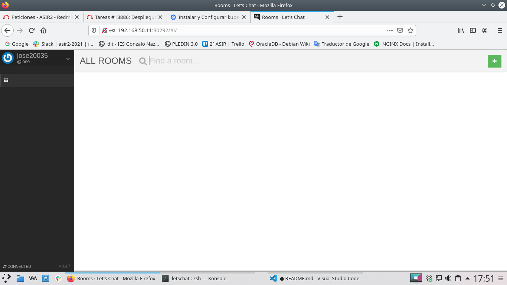

# kubernete-Ansible
Repositorio de Ansible para desplegar kubernete con dos nodos.

En este trabajo hemos automatizado la instalación de kubernete con kubeadm usando vagrant + ansible.

Con Vagrant creamos tres maquinas de 2Gb con 2 Cores de las cuales una sera el nodo maestro y las otras dos nodos trabajadores.

La explicación de la instalación esta en los nombres de los ansible.

## Configuración de kubectl 

Una vez desplegado el escenario lo primero que haremos sera instalar kubectl de la siguiente manera.

```
sudo apt-get update && sudo apt-get install -y apt-transport-https gnupg2 curl
curl -s https://packages.cloud.google.com/apt/doc/apt-key.gpg | sudo apt-key add -
echo "deb https://apt.kubernetes.io/ kubernetes-xenial main" | sudo tee -a /etc/apt/sources.list.d/kubernetes.list
sudo apt-get update
sudo apt-get install -y kubectl
```

Una vez lo hayamos instalado crearemos una carpeta .kube en el home de nuestro usuario en la cual vamos a crear un archivo config.

El archivo config lo sacaremos del la carpeta home de servidor Maestro, en la ubicación _/home/vagrant/.kube/config_

Una vez hayamos pasado ese fichero a nuestro ordenador podremos ejecutar.

```
kubectl get nodes
NAME         STATUS   ROLES                  AGE     VERSION
k8s-master   Ready    control-plane,master   7h21m   v1.20.4
node-1       Ready    <none>                 7h18m   v1.20.4
node-2       Ready    <none>                 7h15m   v1.20.4
```

y veremos los nodos.

## creación de la aplicación.

Para crear la aplicación letschat he creado una serie de archivos .yml que encontrareis en el repositorio dentro de la carpeta letschat.

Los primeros archivos que trataremos serán __letschat-deployment.yaml__ y __mongo-deployment.yaml__

En estos archivos definimos el numero de pod la imagen que va a utilizar sera la de letschat y mongo.

```
kubectl create -f letschat-deployment.yaml
kubectl create -f mongo-deployment.yaml
```

Desplegamos a parte de letschat un mongo puesto que lo necesita la aplicación de letschat para guardad la información.

Pero ahora mismo los pod de letschat no se pueden comunicar con los de mongo por lo que tenemos que crear otro recurso llamado service para ello hemos creado el mongo-srv.yaml.

También tenemos que crear otro para el letschat para poder acceder desde el exterior.

```
kubectl create -f mongo-srv.yaml
kubectl create -f letschat-srv.yaml
```

Para ver los recursos que hemos creado ejecutaremos el siguiente comando.

```
kubectl get pod,deployment,services
NAME                            READY   STATUS    RESTARTS   AGE
pod/letschat-7c66bd64f5-tmqc2   1/1     Running   6          6m59s
pod/mongo-5c694c878b-qxd2b      1/1     Running   0          2m11s

NAME                       READY   UP-TO-DATE   AVAILABLE   AGE
deployment.apps/letschat   1/1     1            1           6m59s
deployment.apps/mongo      1/1     1            1           2m11s

NAME                 TYPE        CLUSTER-IP       EXTERNAL-IP   PORT(S)          AGE
service/kubernetes   ClusterIP   10.96.0.1        <none>        443/TCP          7h32m
service/letschat     NodePort    10.107.226.233   <none>        8080:30292/TCP   70s
service/mongo        ClusterIP   10.100.42.25     <none>        27017/TCP        89s
```

Tras esto ya podemos entrar en nuestra aplicación letschat.



## Configuración de proxy inverso.

Como podemos comprobar existe otro archivo llamado __ingress.yaml__.

Este fichero sirve para crear una servicio de proy inverso pero antes tendríamos que tener un pop controlador de proxy inverso para crearlo estuvimos intentando configurar uno de ngix pero no lo conseguimos, de todas formas cambiamos el archivo yaml a la nueva version y dejo la [pagina](https://docs.nginx.com/nginx-ingress-controller/installation/installation-with-manifests/#configure-rbac) que estuvimos mirando.